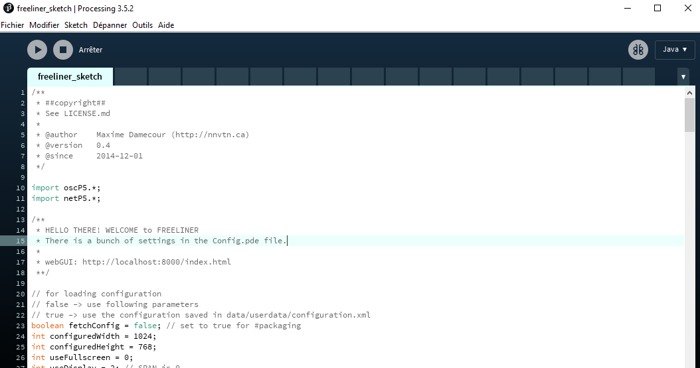
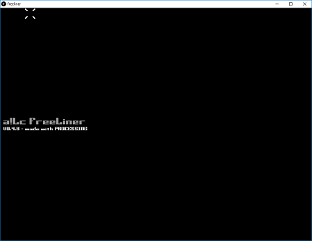
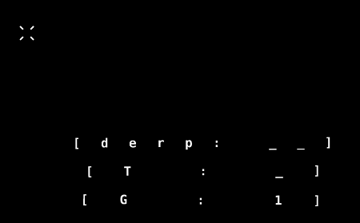
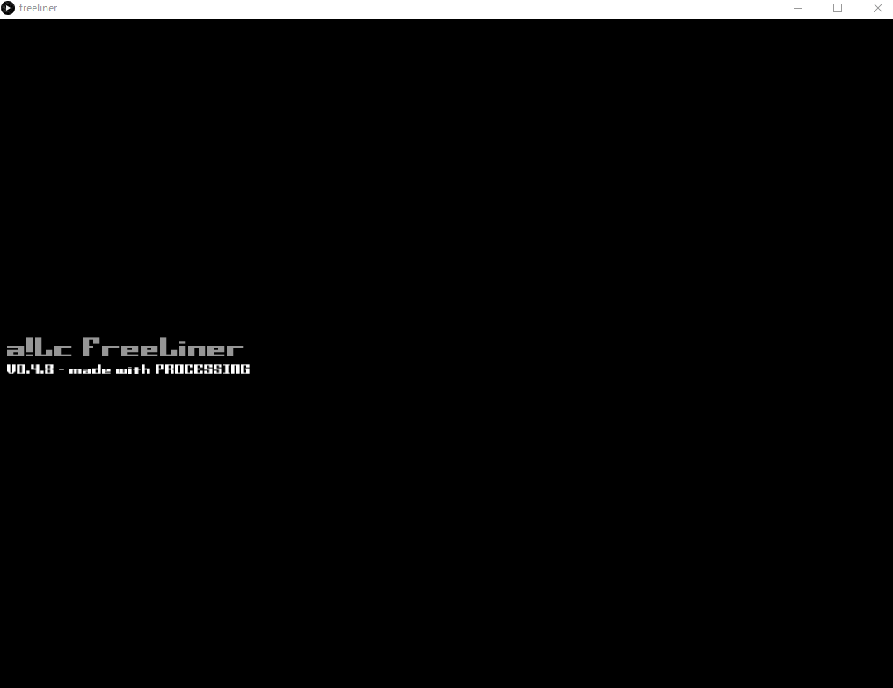

# step by step small example #

Once installed, and you have read the general documentation page, here is a small step-by-step example of what can be done with **a!LcFreeliner**.

First launch Processing and open **freeliner_sketch.pde** file.
You should have :

Then clic on the execute arrow, the Main Animation Screen (**MAS**) appears :

The size of this main screen could be change in the **freeliner_sketch.pde** file, with the paramaters :

    int configuredWidth = 1024;
    int configuredHeight = 768;
    int useFullscreen = 0;

Using windowed will help during testing phase, when you advance in your project, you should definitively use a full screen with a projector.

Then Center-clic at the bottom right, then draw a line to the left.
Center-clic again a little above, draw a second line, and then a third, a fourth and fifth.
Press the tab key.

You wil have information texts like this :

The text size can be modified in the **config.pde** file, in the line :

    final int GUI_FONT_SIZE = 10;

This text zone is dynamic, so it will show you what you type, and what it is expected to *make sense of this madness*.

Then make your first item with pressing the **n** key (new), and then clic somewhere.

Draw a few lines (called **segment**, close the shape by terminating the last line on the first point on this shape.
You have a **segmentGroup**. Then type the **c** key, to place a center of this closed shape.

Like in this example :

The fisrt text line tells you which group you a re working on.

The second one, the Templates you are using.

The third, is what you are rendering, try **q** for example, it asks you to type a color.

So now we will add renderer by typing **A**. The first animation start on the screen.

We are in group 2, rendering **A** template.

It is time to open the GUI Browser Interface (**GBI**) with this link :

http://localhost:8000/index.html

Clic **OK**, you are now connected to your **MainAnimationScreen** screen, select **A**.

It is time to play !
